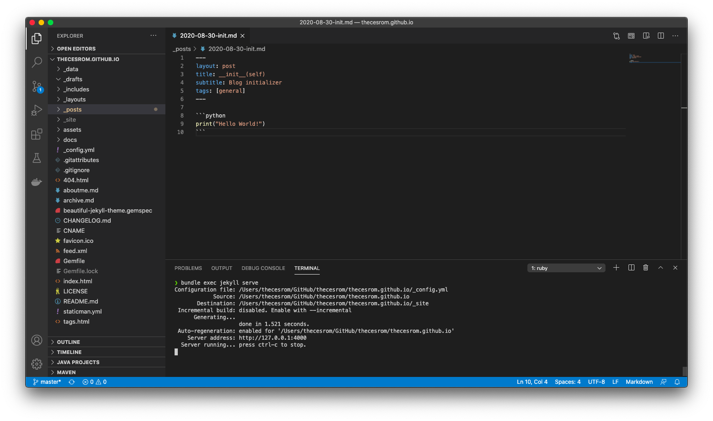

In the past, I've delved in the blogging universe using Blogger, Tumblr, and even WordPress, but after a while, I fell disinchanted with what they had to offer.

I learned about [GitHub Pages](https://pages.github.com/) back in 2013 via the one and only [Phil Haack](https://twitter.com/haacked) ([Dr. Jekyll and Mr. Haack](https://haacked.com/archive/2013/12/02/dr-jekyll-and-mr-haack/)), and now it is that I take the plunge and start experimenting myself.

So here is a guide on how I got myself started using GitHub pages.

### 0. Assumptions

You are already familiar with GitHub and Git and know your way around the command line.

Let's get started!

### 1. Getting started with GitHub pages

There's a very comprehensive guide on how to get started with GitHub pages [here](https://guides.github.com/features/pages/) or [over here](https://docs.github.com/en/github/working-with-github-pages/getting-started-with-github-pages), but if you would like to create your posts locally, after you've created your repo, clone it on your computer, and continue with this guide.

### 2. Getting Jekyll on macOS

I will assume that you already have Xcode and Ruby, so let's go straight to installing Jekyll.

To Install Jekyll as a local install run the following commands:

```bash
gem install -user-install bundler
gem install -user-install jekyll -v 3.9.0
```

With the `-user-install` option you don't have to run these commands with `sudo`, so everything is installed under your user account, and as of this writing the latest version for Jekyll is  4.1.1, which is not yet supported by GitHub Pages (check [here](https://pages.github.com/versions/) for up-to-date dependencies), that's why we specify version `3.9.0`.

```bash
% which jekyll 
/Users/<user>/.gem/ruby/X.X.X/bin/jekyll
% jekyll -v
jekyll 3.9.0
```

Now that we're ready, let's find a theme!

### 3. Finding a Jekyll theme

While you may use the options provided by GitHub, I found [Beautiful Jekyll](https://github.com/daattali/beautiful-jekyll) over at [JAMstack themes](https://jamstackthemes.dev/ssg/jekyll/).

The instructions are very straightforward; found [here](https://github.com/daattali/beautiful-jekyll/blob/master/README.md).


### 4. Editing and testing your Jekyll blog on your local machine

I am using [Visual Studio Code](https://code.visualstudio.com/) for editing my site, but you may use another text editor or IDE out there.

In order to use the correct Jekyll version, I just changed line 20 on `beautiful-jekyll-theme.gemspec` to the following:

```ruby
 spec.add_runtime_dependency "jekyll", "~> 3.9"
```

And after some customization I just run:
```bash
bundle exec jekyll serve
```



And my site is now live at http://127.0.0.1:4000/

And this is the final product:


### 5. Publishing your site and all future posts

With the power of `commit` and `push` you can accomplish anything.

Thanks for reading!